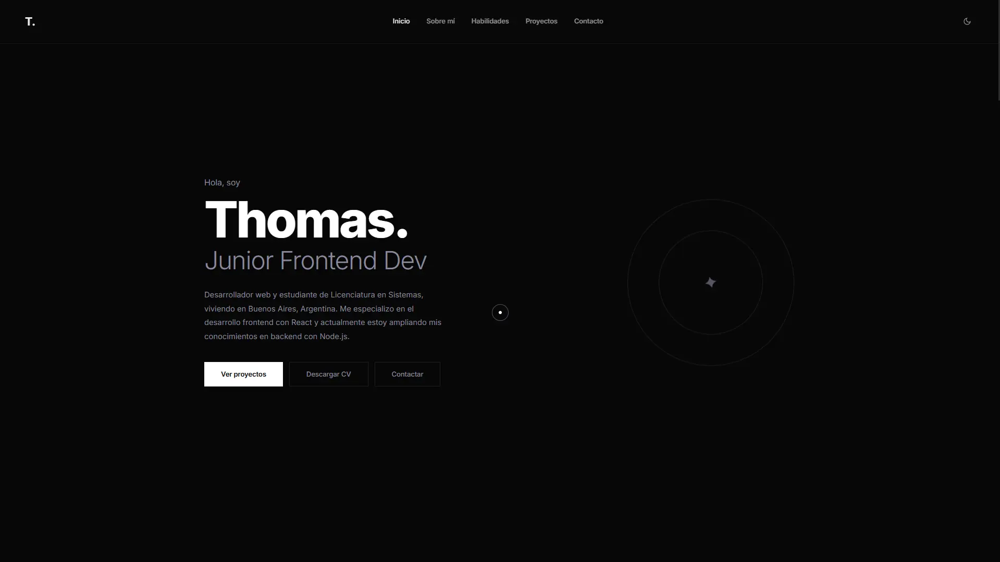

# Personal Portfolio

A modern and responsive portfolio built with React to showcase my projects, skills and experience as a Frontend Developer. It features smooth animations, dark/light theme support, interactive UI elements and a functional contact form powered by EmailJS.

## Features

- Responsive design
- Dark / Light theme
- Smooth scrolling
- Animated typing effect
- Custom cursor
- Scroll progress indicator
- Interactive project filtering
- Image lightbox
- Contact form with EmailJS
- Back to top button

## Technologies

- React
- Vite
- JavaScript
- CSS3
- EmailJS

## Preview



## Live Demo

https://thomas-centurion.vercel.app/

## Installation

Clone the repository

```bash
git clone https://github.com/thomas-centurion/personal-portfolio.git
```

Install dependencies

```bash
npm install
```

Run the development server

```bash
npm run dev
```

Build for production

```bash
npm run build
```

## Contact

LinkedIn: https://www.linkedin.com/in/thomascenturion/
Email: tcenturion.dev@gmail.com